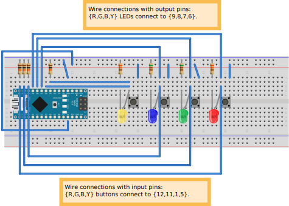

# Simon Says

## Introduction
I bought an Arduino Nano and to get to know its features, I figured I would make this small game. It turns out that concepts like handling buttons (debounce) and pulldown resistors were required to make this one work.

## The game
This classic game generates a random sequence of colors (red, green, blue, yellow), shows the sequence by flashing the LEDs and you have to repeat the sequence using the buttons on the breadboard. When the order is keyed in correctly, the green LED flashes and the difficulty level is increased  (i.e. the sequence is expanded by 1). The expanded sequence is then shown again, and the process repeats. If the keyed sequence is wrong, the red light flashes and you'll have to start over. Reset the device to generate a new sequence.

## Requirements
* Arduino nano or similar device
* Power supply (5V)
* Electrical jump wires
* 4 LEDs with different colors
* 4 resistors to go with the LEDs (I used 2 x 330 $\Ohm$, 2 x 510 $\Ohm$), and 4 pull-down resistors for the INPUT pins (~10 k$\Ohm$)
* 4 push buttons

## Breadboard layout
The layout was made in Fritzing, and can be downloaded here. 

